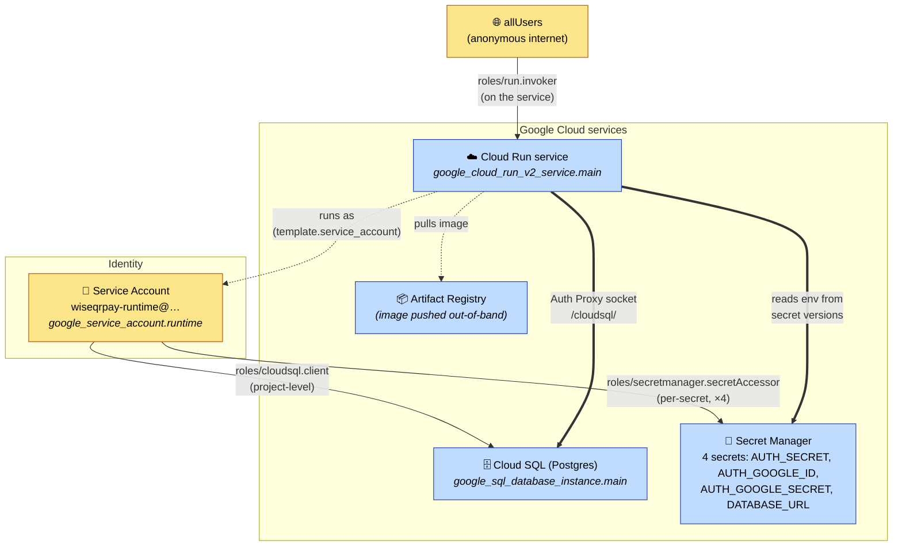

# IAM ↔ Google services — WiseQRPay Cloud Run deploy

How identity is wired in this module. There are only **two principals** and the
whole picture splits into two questions:

- **Who is allowed to *call* the service?** → `allUsers` (anonymous travelers).
- **What is the service allowed to *do* once running?** → its runtime service
  account, granted exactly two powers (read secrets, connect to the DB).

Everything else follows from those two.

**Legend:** solid arrows = IAM grants (a role binding a member to a resource);
dotted `runs as` = the identity the Cloud Run revision assumes; thick `==>` =
the runtime data path the grant *enables* (shown so you can see why each grant
exists, but the data path itself is not IAM).

---

## The grants, one row each

| # | Principal (member) | Role | Scope / where bound | Terraform resource | Why it exists |
|---|--------------------|------|---------------------|--------------------|---------------|
| 1 | `allUsers` | `roles/run.invoker` | the Cloud Run **service** | `google_cloud_run_v2_service_iam_member.public_invoker` | Travelers scan the QR and hit `/pay/[id]` with no login — the service must be anonymously invokable. |
| 2 | `wiseqrpay-runtime` SA | — *(identity assignment, not a role)* | Cloud Run `template.service_account` | `google_cloud_run_v2_service.main` | Pins the revision to a **least-privilege** identity instead of the default Compute SA. This is the hinge: rows 3–4 grant *this* SA. |
| 3 | `wiseqrpay-runtime` SA | `roles/cloudsql.client` | **project-level** | `google_project_iam_member.runtime_cloudsql` | Lets the runtime open a connection through the Cloud SQL Auth Proxy. The role only exists at project scope — there is no per-instance binding for it. |
| 4 | `wiseqrpay-runtime` SA | `roles/secretmanager.secretAccessor` | **per-secret** (×4, one binding each) | `google_secret_manager_secret_iam_member.runtime_database_url` / `…_auth_secret` / `…_auth_google_id` / `…_auth_google_secret` | Lets the runtime read each env-var secret. Bound per-secret rather than project-wide so the SA can read *these four* secrets and nothing else. |

---

## The two distinctions that matter

**1. Inbound vs. outbound.** Row 1 is the *only* inbound grant — it says who may
call the service. Rows 3–4 are *outbound* — they say what the service may reach.
A reader who blurs these will think "the SA is public"; it isn't. `allUsers` can
invoke Cloud Run, but `allUsers` has none of the SA's powers — they can't touch
the database or the secrets. The SA is the wall between the public endpoint and
the data.

**2. "Runs as" is not a role.** Row 2 (`template.service_account`) is an identity
*assignment*, not an IAM policy binding — that's why it's the dotted edge. It's
load-bearing anyway: change that one line to the default Compute SA and rows 3–4
would be granting permissions to an identity the service no longer uses, silently
breaking secret/DB access at runtime while `terraform apply` stays green.

## Scope choices, and what they trade off

- **`roles/cloudsql.client` is project-level** (row 3) because GCP offers no
  per-instance form of it. The blast radius: this SA can act as a client to
  *every* Cloud SQL instance in the project. For a one-instance demo that's
  moot; in a multi-instance project you'd isolate via separate projects or
  rely on the DB user/password (which *is* per-instance here) as the real fence.
- **`secretAccessor` is per-secret** (row 4) — four individual bindings, one per
  secret, rather than one project-wide grant. Add a fifth secret and you add a
  fifth binding; the SA never silently gains read access to unrelated secrets.

## What is *not* here (and why that's fine)

- **No IAM binding on Artifact Registry.** The image is pushed out-of-band
  (manual `docker push`), and Cloud Run pulls it using the platform's own
  service agent, so this module grants nothing there. If you later pull a
  *private* image as the runtime SA, you'd add `roles/artifactregistry.reader`
  for `wiseqrpay-runtime`.
- **No human/operator bindings.** This module provisions the *runtime* identity
  only. Whoever runs `terraform apply` brings their own admin credentials from
  outside the module.

---

*Generated from the `infra-mcp/` Terraform (`service_account.tf`, `secrets.tf`,
`cloud_run.tf`, `database.tf`). This is the kept arm; the `infra-mcp-blind/`
comparison arm was removed after verifying the two had byte-for-byte equivalent
effective IAM.*

*Non-IAM hardening note: `database.tf` does not set `ssl_mode` on the Cloud SQL
instance (it relies on the provider default). The retired blind arm pinned
`ssl_mode = "ENCRYPTED_ONLY"` to force TLS — worth porting over if you want
connections TLS-enforced. This is a data-path setting, not an IAM binding.*
